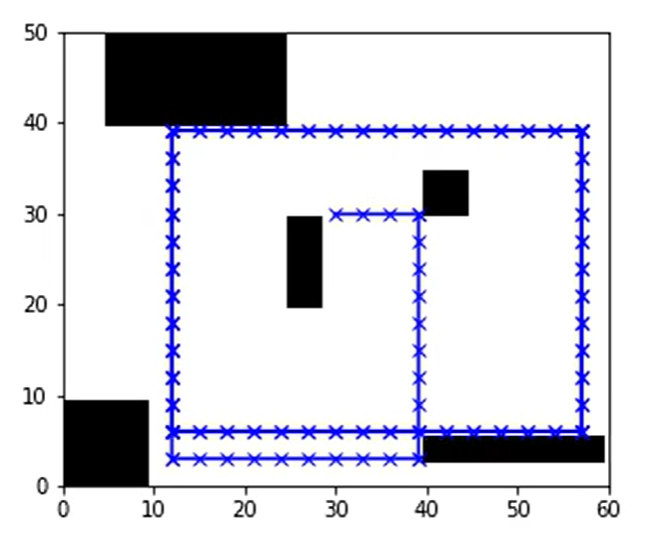
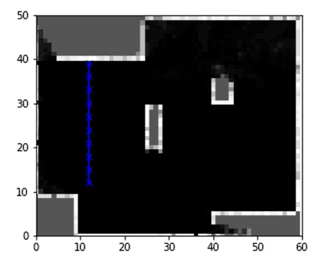

# Self-Driving Car Specialization
This repository contains all the programming assignments from UofT/CourseEra Self-driving Car specialization

### Course 1: Introduction to Self-Driving Cars

These are assignments from the first course in the specialization, they mainly consisted of fundamental controls concepts commonly used in all vehicle models.

- Kinematic Bicycle Model: In this assignment we were tasked to create the kinematic bicycle model which is commonly used to simulate simplified vehicle car dynamics.
- Longitudinal Vehicle Model: This assignment consisted of creating a longitudinal vehicle model that simulates the forward kinematics of a vehicle and updates the linear vehicle states along with the throttle based on different dynamic forces acting on the vehicle.

### Course 4: Motion-Planning for Self-Driving Cars

These are assignments from the fourth course in the specialization, these assignments covered occupancy grid mapping techniques and common motion planning methods using in self-driving cars.

- Occupancy Grid: In this assignment we were tasked with creating a occupancy grid mapping function that utilized the ray tracing algorithm, lidar scanner data, and inverse measurement model to update a belief map through Bayesian log odds updates.

**Actual Map**

**Generated Map**

